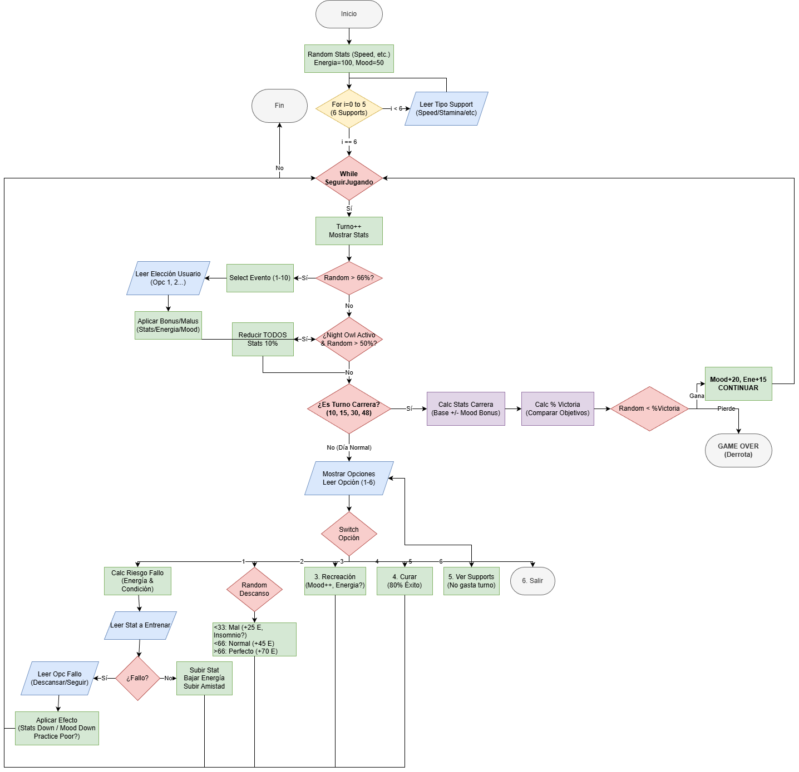

# Umamusume

Este proyecto consiste en una simulación de estrategia y gestión desarrollada en Java, la cual recrea las mecánicas de entrenamiento de la franquicia *Uma Musume* a través de una interfaz de consola.

## Descripción del Proyecto

El simulador es un juego de gestión de recursos y tiempo. El usuario asume el rol de entrenador y debe gestionar las estadísticas de un personaje ("Uma") a lo largo de un ciclo limitado de turnos. El objetivo principal es incrementar los atributos del personaje para superar una serie de carreras obligatorias, culminando en la *URA Finale*.

## Mecánicas de Juego (Cómo se Juega)

El ciclo de juego consta de **48 turnos**. En cada turno, el jugador debe seleccionar una acción estratégica del menú principal para optimizar el rendimiento del personaje antes de las competiciones.

### Flujo Principal
1.  **Inicialización:** Selección aleatoria de una de las 12 Umas disponibles y elección manual de 6 cartas de soporte (*Support Cards*) que otorgan bonificaciones.
2.  **Gestión de Turno:** El jugador dispone de las siguientes opciones:
    * **Entrenar:** Incrementa estadísticas principales (Speed, Stamina, Power, Guts, Wit). Consume energía y conlleva un riesgo de fallo basado en la fatiga actual.
    * **Descanso:** Recupera energía. Existe una probabilidad de obtener un "mal descanso", lo que puede provocar el estado negativo *Night Owl* (Insomnio).
    * **Recreación:** Mejora el estado de ánimo (*Mood*). Un *Mood* elevado otorga bonificaciones pasivas a las estadísticas durante las carreras.
    * **Enfermería:** Permite curar estados alterados negativos como *Practice Poor* o *Night Owl*.
    * **Gestión de Supports:** Visualización del nivel de amistad. Al alcanzar cierto nivel, se desbloquean entrenamientos especiales (*Friendship Training*).
3.  **Competición:** En turnos específicos (10, 15, 30 y 48), se ejecutan eventos de carrera. El éxito se determina mediante una probabilidad calculada en base a las estadísticas acumuladas frente a los objetivos de la carrera.

## Características del Código

* **Sistema de Stats:** 5 estadísticas principales que afectan el porcentaje de victoria.
* **Friendship Training:** Si entrenas mucho con el mismo tipo de Support y subes la amistad a +80, desbloqueas el *Friendship Training* (FT), que da muchos más puntos.
* **Eventos Aleatorios:** Hay un 33% de probabilidad cada turno de que pase algo random (eventos de fans, decisiones difíciles, comida, etc.).
* **Estados Alterados:**
    * *Practice Perfect:* Te salen mejor los entrenamientos.
    * *Practice Poor:* Fallas más entrenando.
    * *Night Owl:* Pierdes energía y stats por no dormir bien.

# Diagrama de flujo:

